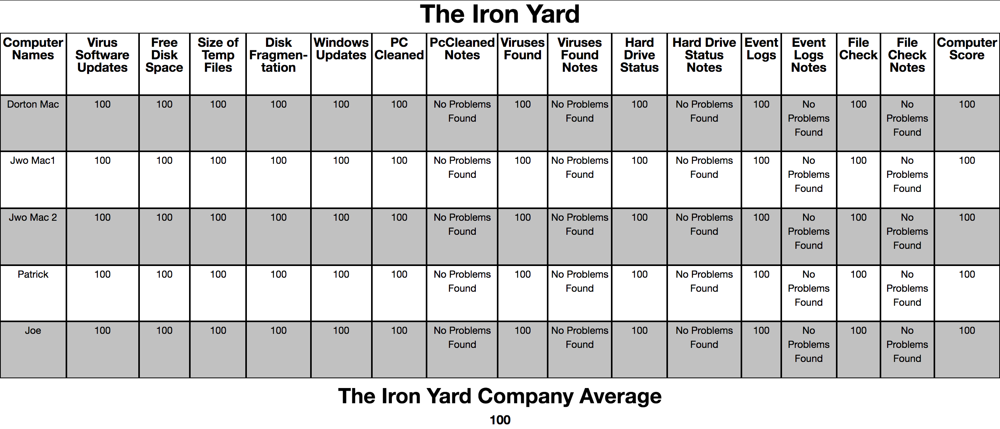

# Scheduled Maintenance App

This project is my final project at [The Iron Yard] after taking the 24 week course. This project shows what i am able to do with Functional React with an immutable data structure.

### Tools Used
* [Create React App]
* [Ratchet]
* [Mori]
* [Firebase]

### Installation

```

git clone git@github.com:MikeStegall/scheduled-maintenance.git
cd scheduled-maintenance
npm install or yarn add
npm start or yarn start
open http://localhost:3000/

```

### Things That You Will Need to Add

Need to go to [Firebase] and create a data base.

Create a `firebase.js` file inside of the src folder and paste

```
import firebase from 'firebase'

// Initialize Firebase
var config = {
    apiKey: "YOUR API KEY",
    authDomain: "app-name.firebaseapp.com",
    databaseURL: "https://app-name.firebaseio.com",
    projectId: "app-name",
    storageBucket: "app-name.appspot.com",
    messagingSenderId: ""
  }
firebase.initializeApp(config)

export default firebase
```

### The Usefulness of this App

This app is for computer technicians that go out to client sites and perform an 11 point check list on their computers. You can use it with a phone or tablet to enter in all the data that you acquire.

The 11 point check list includes:
* Number of Virus Software Updates
* Free Space on Disk
* Size of Temporary Files
* Fragmentation of Hard Drive
* Whether or not you can blow out the PC
* Number of Windows Updates
* If Viruses/Malware found
* If the Hard Drive is good
* If the Event Logs have critical Errors
* If the System Files were corrupt or not
* Whether the computers is a server and if the server is backing up and working.

After the technician fills out this information through the number of computers that the company has it displays the average score to the company. When the technician comes back home they can pull up the company information they just entered.



### Different applications

This app as several different uses. If you have a check list that you want to have you can do it with this app. Whether is be Car Maintenance, cleaning a house or what ever your mind can thing of. The possibilities are endless.


[Create React App]: https://github.com/facebookincubator/create-react-app
[Ratchet]: http://goratchet.com/
[Mori]: http://swannodette.github.io/mori/
[Firebase]: https://firebase.google.com/
[The Iron Yard]: https://www.theironyard.com/
